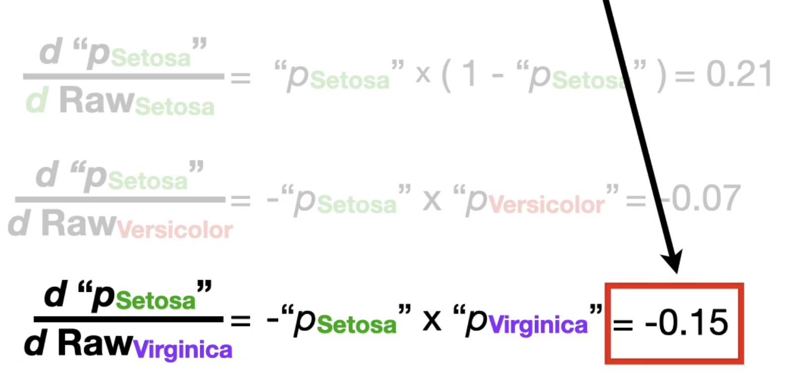

https://www.youtube.com/watch?v=KpKog-L9veg

Softmax
- Softmax is primarily utilized for training, because it can produce outputs that can be derived to see which parameters/bias fits the neural network. The formula is  

<e**'output'/sum(e**i)>

When you get the sum of all quotients, you get 1. Hence, all quotients are between 0 and 1. This makes it easier to determine which value is the best based on which number is closest to 1. 

Derivative of the output

However, these predicted 'probabilities' are not reliable because the weights and biases that produce these outputs are random at the start. So, it needs multiple adjustments before one can say that the weights and biases are optimal. Once those have been calibrated properly, the model can switch to argmax.

Argmax
- Argmax takes the maximum of all outputs and turns that into 1, while the rest of the outputs become 0. This makes it very easy to determine which one is the best predicted output. This one is primarily used for decision-making, because it gives actual answers rather than probabilities to what the answer may be. Which is why it is extremely important that the weights and biases of the model are optimal so that the output is reliable. 

